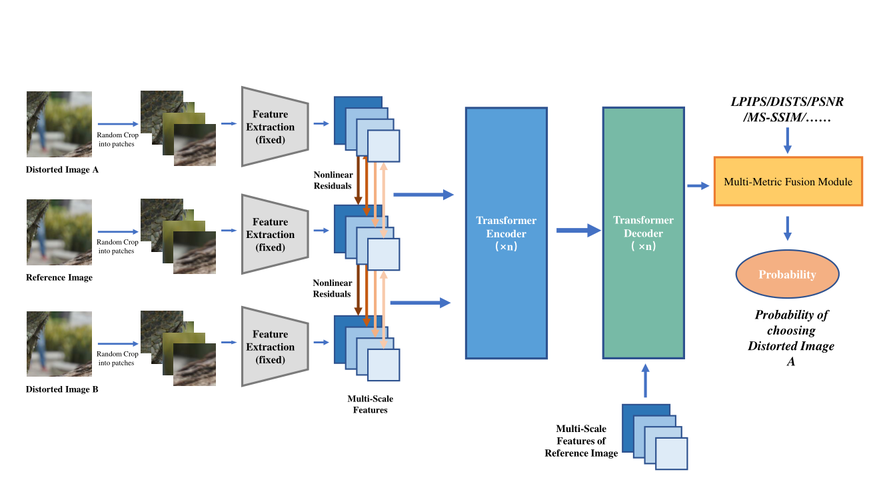

# IQA-TMFM
### 1. Network Architcture.

### 2. Results

| | CLIC2022-Valid | CLIC2022-Test |
| :------: | :-----:| :-----:|
|Accuracy| 0.779 | 0.779 |
### 3. 
If you find this paper or repository useful, please cite.
```
@inproceedings{jiang2022image,
  title={Image quality assessment with transformers and multi-metric fusion modules},
  author={Jiang, Wei and Li, Litian and Ma, Yi and Zhai, Yongqi and Yang, Zheng and Wang, Ronggang},
  booktitle={Proceedings of the IEEE/CVF Conference on Computer Vision and Pattern Recognition (CVPR) Workshops},
  pages={1805--1809},
  year={2022}
}
```
